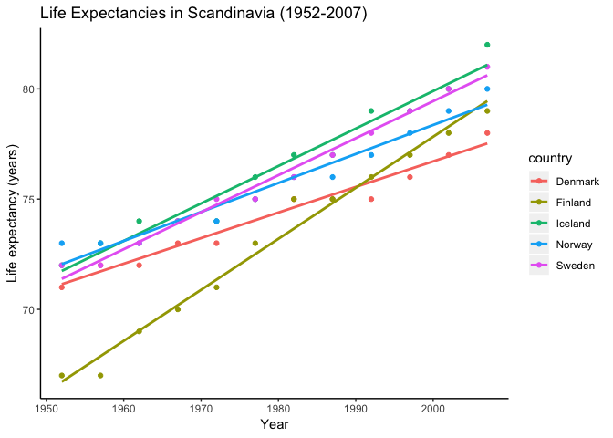

hw04-tsmith93
================
Thomas Smith
2018-10-09

Overview
--------

-   Assignment introduction
-   Load Packages
-   Task Selection

### Assignment introduction

For this assignment, the focus is to refine our data wranglign skills. Specifically, we are hoping to fortify the bridge between data aggregation and data reshaping.

### Loading packages

If you haven't already done so, download both gapminder and tidyverse using `install.packages()`

Next load gapminder, tidyverse and knitr:

``` r
#suppressPackageStartupMessages stops unecessary messages from popping up
suppressPackageStartupMessages(library(tidyverse))
suppressPackageStartupMessages(library(gapminder))
suppressPackageStartupMessages(library(knitr))
```

### Task selection

For this assignment, there are two over-arching themes. The first is "Data Reshaping Prompts (and relationship to aggregation)" and the second one is "Join Prompts (join, merge, look up)". For the first theme, I am selecting Task 5: Data manipulation sampler. For the second theme, I am selecting Task 2: Create your own cheatsheet.

Tibble play
-----------

### Objectives

-   Make a tibble with one row per year and columns for life expectancy for two or more countries.
-   Use knitr::kable() to make this table look pretty in your rendered homework.
-   Take advantage of this new data shape to scatterplot life expectancy for one country against that of another.

### Make a tidy table

First we want to filter out the specific dat we are wanting. For this example, let's just look at Scandinavian countries, as well as their life expectancies and correspondign years.

``` r
#Create an object called 'scandinavia' to store the desired data 
scandinavia <- 
  #call upon the gapminder dataset
  gapminder %>%
  #Filter so that we are only using Canada, Russia, Japan, and United States
  filter(country=="Finland" | country == "Norway" | country == "Sweden" | country == "Iceland" | country == "Denmark") %>% 
  #Mae table cleaner by rounding the life expectancies off the nearest integer
  mutate(lifeExp = round(lifeExp, 0)) %>% 
  #Select the columns country, year and life expectancy
  select(country, year, lifeExp)

  #Make a tidy table using the 'kable' function, rename column headings
  kable(scandinavia, col.names = c("Country", "Year", "Life expectancy (years)"))
```

| Country |  Year|  Life expectancy (years)|
|:--------|-----:|------------------------:|
| Denmark |  1952|                       71|
| Denmark |  1957|                       72|
| Denmark |  1962|                       72|
| Denmark |  1967|                       73|
| Denmark |  1972|                       73|
| Denmark |  1977|                       75|
| Denmark |  1982|                       75|
| Denmark |  1987|                       75|
| Denmark |  1992|                       75|
| Denmark |  1997|                       76|
| Denmark |  2002|                       77|
| Denmark |  2007|                       78|
| Finland |  1952|                       67|
| Finland |  1957|                       67|
| Finland |  1962|                       69|
| Finland |  1967|                       70|
| Finland |  1972|                       71|
| Finland |  1977|                       73|
| Finland |  1982|                       75|
| Finland |  1987|                       75|
| Finland |  1992|                       76|
| Finland |  1997|                       77|
| Finland |  2002|                       78|
| Finland |  2007|                       79|
| Iceland |  1952|                       72|
| Iceland |  1957|                       73|
| Iceland |  1962|                       74|
| Iceland |  1967|                       74|
| Iceland |  1972|                       74|
| Iceland |  1977|                       76|
| Iceland |  1982|                       77|
| Iceland |  1987|                       77|
| Iceland |  1992|                       79|
| Iceland |  1997|                       79|
| Iceland |  2002|                       80|
| Iceland |  2007|                       82|
| Norway  |  1952|                       73|
| Norway  |  1957|                       73|
| Norway  |  1962|                       73|
| Norway  |  1967|                       74|
| Norway  |  1972|                       74|
| Norway  |  1977|                       75|
| Norway  |  1982|                       76|
| Norway  |  1987|                       76|
| Norway  |  1992|                       77|
| Norway  |  1997|                       78|
| Norway  |  2002|                       79|
| Norway  |  2007|                       80|
| Sweden  |  1952|                       72|
| Sweden  |  1957|                       72|
| Sweden  |  1962|                       73|
| Sweden  |  1967|                       74|
| Sweden  |  1972|                       75|
| Sweden  |  1977|                       75|
| Sweden  |  1982|                       76|
| Sweden  |  1987|                       77|
| Sweden  |  1992|                       78|
| Sweden  |  1997|                       79|
| Sweden  |  2002|                       80|
| Sweden  |  2007|                       81|

### Reshape time - wide form!

Lets make this data easier to read.

``` r
#switch data from tidy to wide form using spread() and specify the key and value, or collumn titles and values
spread(scandinavia, key = "country", value = "lifeExp") %>% 
  #Use kable to give the table nice and clean names
  kable(col.names = c("Year", "Finland", "Norway", "Sweden", "Iceland", "Denmark"))
```

|  Year|  Finland|  Norway|  Sweden|  Iceland|  Denmark|
|-----:|--------:|-------:|-------:|--------:|--------:|
|  1952|       71|      67|      72|       73|       72|
|  1957|       72|      67|      73|       73|       72|
|  1962|       72|      69|      74|       73|       73|
|  1967|       73|      70|      74|       74|       74|
|  1972|       73|      71|      74|       74|       75|
|  1977|       75|      73|      76|       75|       75|
|  1982|       75|      75|      77|       76|       76|
|  1987|       75|      75|      77|       76|       77|
|  1992|       75|      76|      79|       77|       78|
|  1997|       76|      77|      79|       78|       79|
|  2002|       77|      78|      80|       79|       80|
|  2007|       78|      79|      82|       80|       81|

It appears that the life expectancy for all of these countries has increased over time.

### Display data in scatterplot

First, grammar!

| Grammar Component     | Specification |
|-----------------------|---------------|
| **data**              | `gapminder`   |
| **aesthetic mapping** | `x`and `y`    |
| **geometric object**  | point & line  |
| scale                 | linear        |
| statistical transform | none          |
| coordinate system     | rectangular   |
| facetting             | none          |

``` r
#call upon object 'scandinavia'
scandinavia %>% 
  #use ggplot with 'year' and 'lifeExp' as x and y
  ggplot(aes(year, lifeExp)) +
  #add a scatterplot with point colour specified by country
  geom_point(aes(colour= country)) +
  #add a title
  ggtitle("Life Expectancies in Scandinavia (1952-2007)") +
  geom_smooth(method = lm, se = FALSE, aes(colour = country)) +
  #add x and y labels
  xlab("Year") +
  ylab("Life expectancy (years)") +
  #clean up the aesthetic of the plot!
  theme(panel.grid.major = element_blank(), panel.grid.minor = element_blank(), panel.background = element_blank(),
  axis.line = element_line(colour = "black")) 
```



What a nice way to look at the data :) You can see from this graph that the life expectancy in Finland was the lowest at first, but it has increased the most rapidly. It appears the life expectancy in Denmark has increased the slowest. Overall, life expectancy in Scandinavian countries in 2007 was the late 70s - early 80s.

Join prompts cheatsheet - Favourite vocalists example
-----------------------------------------------------

### The data

We will create two small dataframes, `vocalists` and `labels`, to start off:

``` r
#assign a name to the dataframes first, followed by the collumn names, and then the contained data
vocalists <- "
Name, Gender, Genre, Label
Celine, female, pop, Columbia
Eddie, male, rock, Republic
Florence, female, rock, Republic,
Whitney, female, pop, RCA
Mariah, female, pop, Columbia
Freddie, male, rock, Columbia
Robert, male, rock, Atlantic
"
#make the datframe into a csv
vocalists <- read_csv(vocalists, skip = 1)
```

    ## Warning in rbind(names(probs), probs_f): number of columns of result is not
    ## a multiple of vector length (arg 2)

    ## Warning: 1 parsing failure.
    ## row # A tibble: 1 x 5 col     row col   expected  actual    file         expected   <int> <chr> <chr>     <chr>     <chr>        actual 1     3 <NA>  4 columns 5 columns literal data file # A tibble: 1 x 5

``` r
#repeat for second dataframe
labels <- "
Label, Year Founded
Columbia, 1887
RCA, 1901
Republic, 1995
Arista, 1974
"

labels <- read_csv(labels, skip = 1)

kable(vocalists)
```

| Name     | Gender | Genre | Label    |
|:---------|:-------|:------|:---------|
| Celine   | female | pop   | Columbia |
| Eddie    | male   | rock  | Republic |
| Florence | female | rock  | Republic |
| Whitney  | female | pop   | RCA      |
| Mariah   | female | pop   | Columbia |
| Freddie  | male   | rock  | Columbia |
| Robert   | male   | rock  | Atlantic |

``` r
kable(labels)
```

| Label    |  Year Founded|
|:---------|-------------:|
| Columbia |          1887|
| RCA      |          1901|
| Republic |          1995|
| Arista   |          1974|

### Mutating joins

These combine variables from the two dataframes

#### Inner joins

> Return all rows from x where there are matching values in y, and all columns from x and y. If there are multiple matches between x and y, all combination of the matches are returned.

##### Vocalists = x, labels = y

``` r
(ijvl <- inner_join(vocalists, labels)) %>% 
#pipe into kable function for a nice clean look!  
 kable()
```

    ## Joining, by = "Label"

| Name     | Gender | Genre | Label    |  Year Founded|
|:---------|:-------|:------|:---------|-------------:|
| Celine   | female | pop   | Columbia |          1887|
| Eddie    | male   | rock  | Republic |          1995|
| Florence | female | rock  | Republic |          1995|
| Whitney  | female | pop   | RCA      |          1901|
| Mariah   | female | pop   | Columbia |          1887|
| Freddie  | male   | rock  | Columbia |          1887|

``` r
#note that joining, by = "Label" is telling you that the dataframes are being joined by the variable "Label"
```

For this, we lose Robert because even though he is in `vocalists`, his label is not in `labels`. We also lose Arista from `labels`, as it is not present in `vocalists`. Though, the join has all variables present in both dataframes.

##### Labels = x, vocalists = y

``` r
(ijlv <- inner_join(labels, vocalists)) %>% 
  kable()
```

    ## Joining, by = "Label"

| Label    |  Year Founded| Name     | Gender | Genre |
|:---------|-------------:|:---------|:-------|:------|
| Columbia |          1887| Celine   | female | pop   |
| Columbia |          1887| Mariah   | female | pop   |
| Columbia |          1887| Freddie  | male   | rock  |
| RCA      |          1901| Whitney  | female | pop   |
| Republic |          1995| Eddie    | male   | rock  |
| Republic |          1995| Florence | female | rock  |

For this, we again lose Robert and Arista. Also this time, the variables in `labels` appear first.

#### Left joins

> Return all rows from x, and all columns from x and y. Rows in x with no match in y will have NA values in the new columns. If there are multiple matches between x and y, all combinations of the matches are returned.

##### Vocalists = x, labels = y

``` r
(ljvl <- left_join(vocalists, labels)) %>% 
  kable()
```

    ## Joining, by = "Label"

| Name     | Gender | Genre | Label    |  Year Founded|
|:---------|:-------|:------|:---------|-------------:|
| Celine   | female | pop   | Columbia |          1887|
| Eddie    | male   | rock  | Republic |          1995|
| Florence | female | rock  | Republic |          1995|
| Whitney  | female | pop   | RCA      |          1901|
| Mariah   | female | pop   | Columbia |          1887|
| Freddie  | male   | rock  | Columbia |          1887|
| Robert   | male   | rock  | Atlantic |            NA|

For this, we lose Arista as it is not present in `vocalists` (the x dataframe), and NA appears in Year Founded for Atlantic records, as this data does not exist.

##### Labels = x, vocalists = y

``` r
(ljlv <- left_join(labels, vocalists)) %>% 
 kable()
```

    ## Joining, by = "Label"

| Label    |  Year Founded| Name     | Gender | Genre |
|:---------|-------------:|:---------|:-------|:------|
| Columbia |          1887| Celine   | female | pop   |
| Columbia |          1887| Mariah   | female | pop   |
| Columbia |          1887| Freddie  | male   | rock  |
| RCA      |          1901| Whitney  | female | pop   |
| Republic |          1995| Eddie    | male   | rock  |
| Republic |          1995| Florence | female | rock  |
| Arista   |          1974| NA       | NA     | NA    |

For this, collumns present in `labels` is presented first, Robert is lost as he is not present in `labels`. As well for Arista, NA appears for "Name", "Gender", and "Genre" as this information does not exist in the dataframe `labels`.

#### Right joins

> Return all rows from y, and all columns from x and y. Rows in y with no match in x will have NA values in the new columns. If there are multiple matches between x and y, all combinations of the matches are returned.

##### Vocalists = x, labels = y

``` r
(rjvl <- right_join(vocalists, labels)) %>% 
 kable()
```

    ## Joining, by = "Label"

| Name     | Gender | Genre | Label    |  Year Founded|
|:---------|:-------|:------|:---------|-------------:|
| Celine   | female | pop   | Columbia |          1887|
| Mariah   | female | pop   | Columbia |          1887|
| Freddie  | male   | rock  | Columbia |          1887|
| Whitney  | female | pop   | RCA      |          1901|
| Eddie    | male   | rock  | Republic |          1995|
| Florence | female | rock  | Republic |          1995|
| NA       | NA     | NA    | Arista   |          1974|

The same data is returned as left\_join(labels, vocalists), though the order of data from the two dataframes is reversed.

##### Labels = x, vocalists = y

``` r
(rjlv <- right_join(labels, vocalists)) %>% 
 kable()
```

    ## Joining, by = "Label"

| Label    |  Year Founded| Name     | Gender | Genre |
|:---------|-------------:|:---------|:-------|:------|
| Columbia |          1887| Celine   | female | pop   |
| Republic |          1995| Eddie    | male   | rock  |
| Republic |          1995| Florence | female | rock  |
| RCA      |          1901| Whitney  | female | pop   |
| Columbia |          1887| Mariah   | female | pop   |
| Columbia |          1887| Freddie  | male   | rock  |
| Atlantic |            NA| Robert   | male   | rock  |

The same data is returned as left\_join(vocalists, labels), though the order of data from the two dataframes is reversed.

#### Full join

> Return all rows and all columns from both x and y. Where there are not matching values, returns NA for the one missing.

``` r
(fjlv <- full_join(vocalists, labels)) %>% 
 kable()
```

    ## Joining, by = "Label"

| Name     | Gender | Genre | Label    |  Year Founded|
|:---------|:-------|:------|:---------|-------------:|
| Celine   | female | pop   | Columbia |          1887|
| Eddie    | male   | rock  | Republic |          1995|
| Florence | female | rock  | Republic |          1995|
| Whitney  | female | pop   | RCA      |          1901|
| Mariah   | female | pop   | Columbia |          1887|
| Freddie  | male   | rock  | Columbia |          1887|
| Robert   | male   | rock  | Atlantic |            NA|
| NA       | NA     | NA    | Arista   |          1974|

All the data from both dataframes is presented, and NA is present where there is no crossover data.

### Filtering joins

These keep cases from the left-hand dataframe

#### Semi joins

> Return all rows from x where there are matching values in y, keeping just columns from x.

> A semi join differs from an inner join because an inner join will return one row of x for each matching row of y, where a semi join will never duplicate rows of x.

##### Vocalists = x, labels = y

``` r
(sjvl <- semi_join(vocalists, labels)) %>% 
 kable()
```

    ## Joining, by = "Label"

| Name     | Gender | Genre | Label    |
|:---------|:-------|:------|:---------|
| Celine   | female | pop   | Columbia |
| Eddie    | male   | rock  | Republic |
| Florence | female | rock  | Republic |
| Whitney  | female | pop   | RCA      |
| Mariah   | female | pop   | Columbia |
| Freddie  | male   | rock  | Columbia |

We lose Robert here, similar to the inner join, but the variable year in `label` is not returned.

##### Labels = x, vocalists = y

``` r
(sjlv <- semi_join(labels, vocalists)) %>% 
  kable()
```

    ## Joining, by = "Label"

| Label    |  Year Founded|
|:---------|-------------:|
| Columbia |          1887|
| RCA      |          1901|
| Republic |          1995|

We lose Arista, as it is not present n `vocalists` and only columns from `labels` are kept.

#### Anti joins

> Return all rows from x where there are not matching values in y, keeping just columns from x.

##### Vocalists = x, labels = y

``` r
(ajvl <- anti_join(vocalists, labels)) %>% 
 kable()
```

    ## Joining, by = "Label"

| Name   | Gender | Genre | Label    |
|:-------|:-------|:------|:---------|
| Robert | male   | rock  | Atlantic |

Only Robert is kept, as Atlanic is not present in `labels`.

##### Labels = x, vocalists = y

``` r
(ajlv <- anti_join(labels, vocalists)) %>% 
 kable()
```

    ## Joining, by = "Label"

| Label  |  Year Founded|
|:-------|-------------:|
| Arista |          1974|

Only Arista is kept, as it is not present in `vocalists`.

### Merge

> Merge two data frames by common columns or row names, or do other versions of database join operations.

``` r
merge(labels, vocalists) %>% 
  #Again use kable to make a clean table
  kable()
```

| Label    |  Year Founded| Name     | Gender | Genre |
|:---------|-------------:|:---------|:-------|:------|
| Columbia |          1887| Celine   | female | pop   |
| Columbia |          1887| Mariah   | female | pop   |
| Columbia |          1887| Freddie  | male   | rock  |
| RCA      |          1901| Whitney  | female | pop   |
| Republic |          1995| Eddie    | male   | rock  |
| Republic |          1995| Florence | female | rock  |

Data from Robert, who is associated with Atlantic, and Arista are lost, as those labels are not common for both dataframes.

Conclusion
----------

Very fun exercises there! I hope you learnt something from this assignment :)
